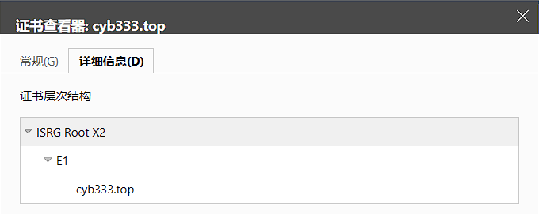

非对称加密与PKI(公钥基础设施)

<!--more-->
### 对称加密与非对称加密

***

在介绍非对称加密之前需要先了解对称加密与非对称加密的概念。

对称加密指的是加密和解密使用的密钥(密码)是相同的，AES ( Advanced Encryption Standard ) 是一个公开的对称加密算法，目前使用最广泛的对称加密算法为 AES256。在加密算法安全的前提下对称加密的难点在于如何交换密钥，加密的密钥与算法与对称加密的安全性息息相关，密钥一旦泄露，加密的内容将不再安全。

非对称加密在加密和解密时使用的是密钥对，密钥对由公钥和私钥组成，公钥推导不出私钥，私钥可以推导出公钥(要保管好自己的私钥)，由公钥加密的文件由私钥解密，由私钥加密的文件由公钥解密。在交换过公钥后便可公开传递由公钥加密后的密文，接收到密文后双方使用私钥解密。目前使用最广泛的非对称加密算法为 RSA，RSA1024 已被证实可以被破解，因此使用 RSA 算法时推荐使用 RSA4096，尽量在 RSA2048以上。RSA正在被新的非对称加密算法 ECC ( 椭圆曲线算法 ) 取代，ECC 算法在安全性与 RSA 相同时密钥长度比RSA短了很多，同时加密解密速度更快，对性能要求更低。

目前大部分 CPU 和一些 MCU 有对 AES 加速的硬件设计，对称加密解密消耗的计算资源远小于非对称加密，因此大文件一般用非对称加密传输对称加密的密钥，用对称加密来加密文件。

### 公钥体系

***

非对称加密解决了公开传输密钥的问题，但在无法确认公钥来源时，公钥的交换过程可能会遭受中间人攻击。

在 A 和 B 交换密钥时，C 在中间，C 分别和 A 和 B 交换公钥，在 A 和 B 交换数据时，C 在中间做转发，在 A 和 B 看来自己是在和对方加密通信，但却有个中间在中间监听，因此在非对称加密中公钥的交换过程十分重要，在互联网上或者无法亲自确认公钥来源的场合，公钥的交换变成了问题。

为了解决这个问题，建立了 PKI ( Public Key Infrastructure，公钥基础设施 )。自己无法确认公钥来源，可以让专门的机构来确认证书的来源，这种专门的机构就叫做 CA ( Certificate Authority，证书颁发机构 ) ，认为 CA 是完全可信的是使用CA证书的前提，CA 有一对证书，公钥在电脑手机出厂前已经内置，部分浏览器自带 CA 证书，这种 CA 的公钥称为根证书。CA 会用自己的技术手段来确认申请人身份，核实确认过之后使用 CA 的私钥为确认过身份的申请人的证书签名，如果我们信任此 CA，那么便可以信任申请人的证书，这便形成了一条信任链。通常 CA 不会用根证书来为第三方签名，一般是用自己的根证书为自己的签署一个短期的证书，用短期的证书来为确认过身份的第三方签名，所以在浏览器中看到域名的证书一般是三级证书或者四级证书。

