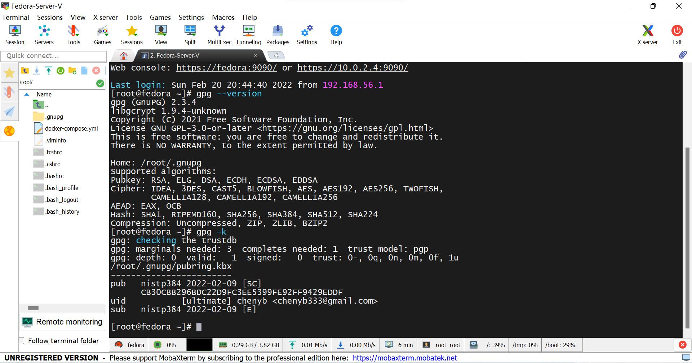
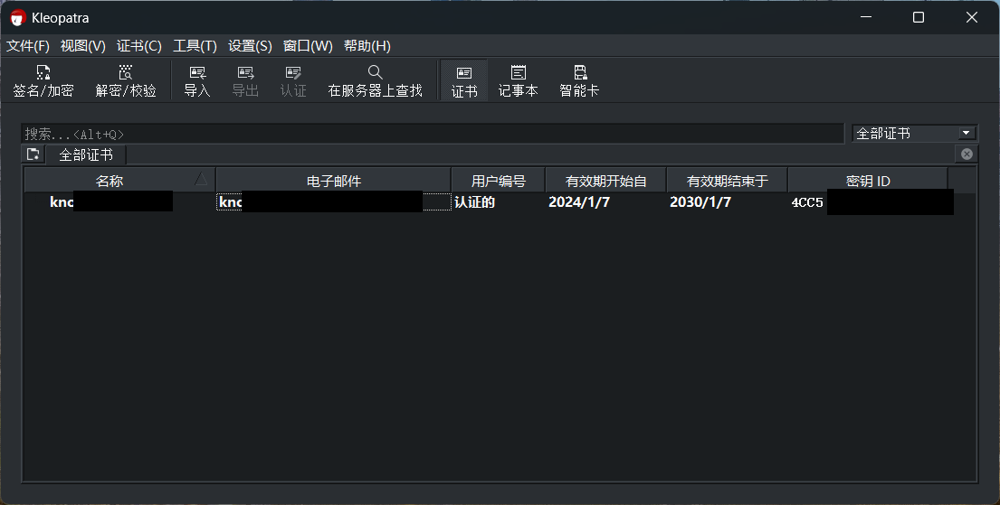

如何使用GnuPG进行加密解密和签名

<!--more-->

GnuPG 是一个开源软件，开源协议为 GNU General Public License，在学习 GnuPG 如何使用前可以先了解一下[公钥体系](A1-公钥体系.md)和加密原理。

GnuPG 支持多平台，在 Linux 平台为 GnuPG，在 Windows 平台为 Gpg4win，GnuPG 平台为 CLI (命令行操作)，Gpg4win 支持 CLI 和 GUI (图形化操作)。

CLI 界面显示版本信息，使用 *`gpg -k`* 命令列出密钥对

Windows 下 GUI 界面

在 Windows 下可以使用 GUI 和 CLI，GUI 界面无需多说，在 CMD 或者 GIt Bash 中可以直接使用和 Linux 中相同的操作命令:

> *gpg -k*

列出本地生成的密钥和已经导入的密钥:

> *gpg edit \<key-name\>*

编辑导入的密钥，新导入的密钥的信任等级为 *`Unknow`* ，使用此命令进入编辑密钥的二级菜单，修改信任等级命令为 *`trust`* ,给选中密钥签名为 *`sign`* 。修改信任等级与签名导入密钥均在修改密钥的二级菜单，在二级菜单输入 *`help`* 查看二级菜单帮助。

使用 *`gpg --help`* 命令可以查看 GunPG 的帮助手册，手册中有对基础命令的解释，同时列举了大部分常用命令。

> *gpg -se -r Bob \<Filename\>*

用自己的私钥(已经生成自己的密钥对)给 *`<Filename>`* 签名并为 *Bob* ( 已经导入 *Bob* 的公钥并修改信任等级为其签名, *Bob* 为已经导入的公钥的 Key-ID ) 加密，将签名后加密的文件输出为 *`<Filename.gpg>`* 。

> *gpg -o \<Out Put Filename\> -d \<Filename.gpg\>*

用自己的私钥解密 *`<Filename.gpg>`* ( 该文件使用自己的公钥加密 )，将解密后的文件输出为 *`<Out Put Filename>`* 并验是否由已经信任的公钥对应的私钥签名 ( 如果加密文件内含签名 )，签名验证成功命令行将提示 *`Good Signature From XXX`* 。
